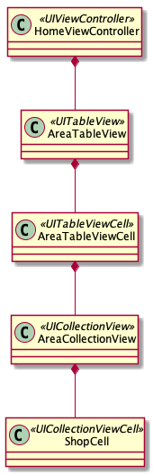

# README

This app puts UICollectionView in UITableViewCell. You can scroll store info in an area horizontally, besides scrolling vertically.

## Environment

- Xcode10.1, swift4.2
- macOS10.14.1

## Class Diagram

## Reference

[UIの問題（２） · stv-ekushida/iOSTraining Wiki](https://github.com/stv-ekushida/iOSTraining/wiki/UI%E3%81%AE%E5%95%8F%E9%A1%8C%EF%BC%88%EF%BC%92%EF%BC%89)

[Putting a UICollectionView in a UITableViewCell in Swift - Ash Furrow](https://ashfurrow.com/blog/putting-a-uicollectionview-in-a-uitableviewcell-in-swift/)

[UITableViewCellにCollectionViewを入れる - Qiita](https://qiita.com/akspect/items/f996dd09cb05051e09ca)

### Document

Only Japanese, sorry.

#### ScreenShots

[Macで画面を録画してGIFに変換する方法 - タダケンのEnjoy Tech](https://tadaken3.hatenablog.jp/entry/mov-to-gif)

#### Plant Uml

[PlantUML Cheat Sheet - Qiita](https://qiita.com/ogomr/items/0b5c4de7f38fd1482a48)

[クラス図の構文と機能](http://plantuml.com/class-diagram)

### Xcode

[Xcode 10 keyboard shortcuts cheat sheet – craiggrummitt – Medium](https://medium.com/@craiggrummitt/xcode-10-keyboard-shortcuts-cheat-sheet-d141eb50f33e)

### JSON Mapping

[Instantly parse JSON in any language | quicktype](https://app.quicktype.io/)

### Git

[gitのローカルのブランチ名を変更したい - Qiita](https://qiita.com/suin/items/96c110b218d919168d64)